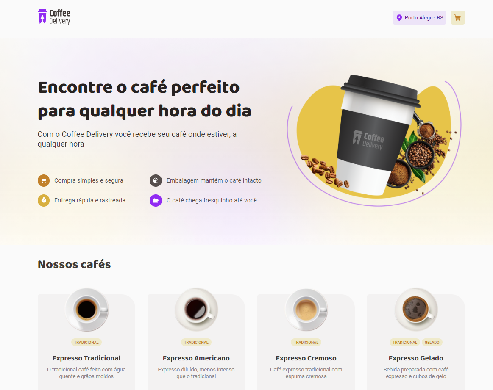

<!-- Title -->
<h1 align="center"> RocketSeat 🔥 Ignite ReactJS </h1>

<!-- Subtitle -->
<h2 align="center"> Desafio 2 - Praticando Conceitos ( Coffee Delivery ) </h2>

<!-- Sobre o Projeto -->
## 🚀 Sobre o Projeto
Nesse desafio, você vai desenvolver uma aplicação para gerenciar um carrinho de compras de uma cafeteria fictícia, que contém as seguintes funcionalidades:

* Listagem de produtos (cafés) disponíveis para compra
* Adicionar uma quantidade específicas de itens no carrinho
* Aumentar ou remover a quantidade de itens no carrinho
* Formulário para o usuário preencher o seu endereço
* Exibir o total de itens no carrinho no Header
* Exibir o valor total da soma de itens no carrinho multiplicados pelo valor

Apesar de serem poucas funcionalidades, você vai precisar relembrar conceitos como:

* Estados
* ContextAPI
* LocalStorage
* Imutabilidade do estado
* Listas e chaves no ReactJS
* Propriedades
* Componentização


## 🖼️ Imagens do Projeto
<div align="center">
  
</div>

## 🧰 Tecnologias e Bibliotecas

* [ReactJS](https://pt-br.reactjs.org/tutorial/tutorial.html)
* [Styled Component](https://www.npmjs.com/package/styled-components) - Biblioteca CSS in JS
* [TypeScript](https://www.typescriptlang.org/)


## ⚙️ Rodando o Projeto
```bash
# Clone este repositório para a pasta anterior
$ git clone https://github.com/guilherme-studier/react-challenge-ignite-01.git
# ou use a opção de download.

# Instale as dependências
$ yarn install
ou
$ npm install

# Executando o Projeto
$ yarn dev 
ou
$ npm dev

# Acesse http://localhost:3000 no seu navagador
```
